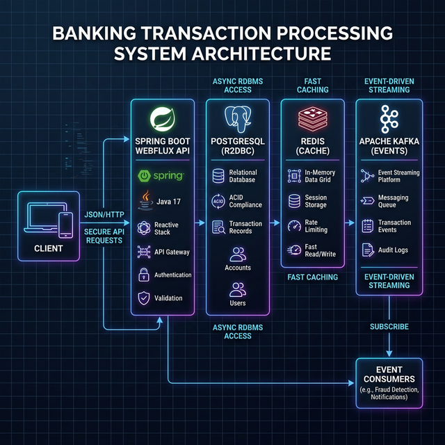
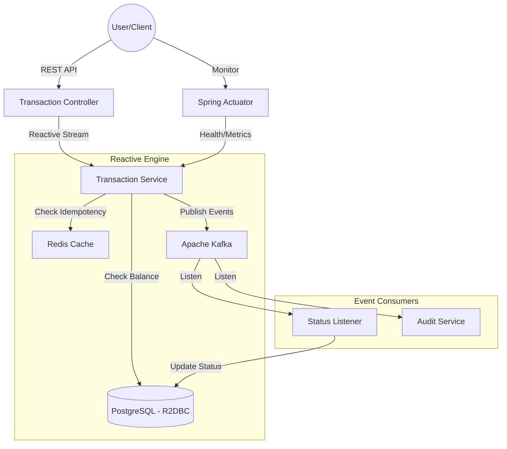

# 🏦 Banking Transaction Processing System

A high-performance, reactive banking microservice designed for massive scale and reliability. Built with **Spring WebFlux**, **Apache Kafka**, and **PostgreSQL**.

---

### 🏗️ Architecture Overview



The system follows a **Reactive Event-Sourced** architecture:



---

## ⚙️ Internal Lifecycle of a Transaction (The Process)

To ensure 1M+ daily transactions with zero data loss, every request goes through a rigorous **7-stage lifecycle**:

### 1. Entry & Validation
*   **Gateway**: The request hits the Netty-based Spring WebFlux endpoint.
*   **Schema Validation**: The DTO is validated for required fields (UUID formats, non-zero amounts, currency codes).

### 2. Idempotency Check (Redis)
*   The `idempotencyKey` is checked against **Redis**.
*   If the key exists, the cached response is returned immediately to prevent duplicate processing (crucial for network retries).

### 3. Reactive Service Logic
*   The `TransactionService` initiates a non-blocking workflow.
*   **Optimistic Locking**: The system fetches account balances using R2DBC. It uses the `@Version` field to ensure that if two transactions hit the same account simultaneously, only one succeeds without losing data.

### 4. ACID Persistence (PostgreSQL)
*   The transaction and account updates are bundled into a single reactive database transaction.
*   **Atomicity**: Either both the debit and credit succeed, or the entire operation rolls back.

### 5. Event Sourcing (Kafka)
*   Once the DB commits, a `TRANSACTION_INITIATED` event is pushed to **Apache Kafka** (`transaction-events` topic).
*   Even if the app crashes now, the record exists in Kafka for downstream reconciliation.

### 6. Asynchronous Status Propagation
*   A dedicated **Status Listener** consumes the Kafka event.
*   It updates the transaction status to `COMPLETED` and publishes a final `TRANSACTION_STATUS` event.

### 7. Cache Update & Response
*   The final result is written back to Redis and returned to the user as a `200 OK`.

---

## 🚦 Getting Started

### 1. Launch Infrastructure
Before running the app, start the core services:
```bash
docker-compose up -d postgres redis kafka
```

### 2. Run Application
Compile and start the Spring Boot service:
```bash
./gradlew bootRun
```

---

## 🚀 Step-by-Step Operation Guide

Follow these steps to perform a complete end-to-end transaction test cycle.

### Step 1: Create Test Accounts
You need at least two accounts (Source and Destination).
*   **Action**: Send `POST /api/v1/accounts/create`
*   **Payload**:
    ```json
    {
      "accountNumber": "USER-A-001",
      "holderName": "Alice",
      "initialBalance": 1000.00,
      "currency": "USD"
    }
    ```
*   **Note**: Save the `id` from the response (UUID). Repeat for "USER-B-001".

### Step 2: Process a Transaction
Transfer funds from Alice to Bob.
*   **Action**: Send `POST /api/v1/transactions/process`
*   **Payload**:
    ```json
    {
      "idempotencyKey": "unique-test-key-001",
      "transactionType": "TRANSFER",
      "sourceAccountId": "<Alice_UUID>",
      "destinationAccountId": "<Bob_UUID>",
      "amount": 100.00,
      "currency": "USD"
    }
    ```

### Step 3: Verify the Result
Check if the transaction was successful and balances were updated.
*   **Check Status**: `GET /api/v1/transactions/{transactionId}/status`
*   **Check History**: `GET /api/v1/transactions/history?accountId=<Alice_UUID>`
*   **Check Balance**: `GET /api/v1/accounts/<Alice_UUID>/balance`

---

## ⚙️ API Response Structure

All endpoints return a standardized wrapper:

### ✅ Success Response (200/201)
```json
{
  "success": true,
  "message": "Operation successful",
  "data": { ... },
  "timestamp": "2026-02-28T20:25:00.000000"
}
```

### ❌ Error Response (400/404/409/500)
```json
{
  "success": false,
  "message": "Description of the error",
  "timestamp": "2026-02-28T20:25:00.000000",
  "errorCode": "SPECIFIC_ERROR_CODE"
}
```

---

## 🚦 Account Management (`/api/v1/accounts`)

### Create Account
**Endpoint:** `POST /create`

#### ✅ Request (Success Case)
```json
{
  "accountNumber": "ACC-TEST-101",
  "holderName": "John Doe",
  "initialBalance": 5000.00,
  "currency": "USD",
  "accountType": "SAVINGS"
}
```

---

## 💸 Transaction Engine (`/api/v1/transactions`)

### Process Transaction (TRANSFER)
**Endpoint:** `POST /process`

#### ✅ Request (Success)
```json
{
  "idempotencyKey": "unique-uuid-001",
  "transactionType": "TRANSFER",
  "sourceAccountId": "75a55369-dd88-4daf-bc36-950493d189ef",
  "destinationAccountId": "85a4c197-0251-42f4-8693-1215e520767f",
  "amount": 100.00,
  "currency": "USD",
  "description": "Lunch split",
  "channel": "ONLINE"
}
```

#### ❌ Request (Bad Request - Invalid UUID Format)
```json
{
  "idempotencyKey": "key-001",
  "transactionType": "TRANSFER",
  "sourceAccountId": "invalid-id-format",
  "destinationAccountId": "85a4c197-0251-42f4-8693-1215e520767f",
  "amount": 100.00
}
```
**Response (400):**
```json
{
  "success": false,
  "message": "DecodingException: Cannot deserialize UUID from value 'invalid-id-format'",
  "timestamp": "2026-02-28T20:25:00.456",
  "errorCode": "BAD_REQUEST"
}
```

---

## 📦 Bulk Operations (`/bulk`)

#### ✅ Request (Success)
```json
{
  "idempotencyKey": "bulk-batch-001",
  "batchId": "PAYROLL-FEB",
  "sourceAccountId": "75a55369-dd88-4daf-bc36-950493d189ef",
  "processingMode": "PARALLEL",
  "transactions": [
    { "sequenceNumber": 1, "destinationAccountId": "85a4c197-0251-42f4-8693-1215e520767f", "amount": 50.00 }
  ]
}
```

---

## 🛠️ Monitoring & Specs

### Kafka Topics
| Topic Name | Purpose |
| :--- | :--- |
| `transaction-events` | Every transaction initiated. |
| `transaction-status` | Successful/Failed state transitions. |

### Health Checks
*   **Health**: `GET /actuator/health`
*   **Metrics**: `GET /actuator/metrics`

---

## 🛑 Error Handling

The API uses standard HTTP status codes and a unified error response format:

| Status Code | Error Code | Description |
| :--- | :--- | :--- |
| `400` | `VALIDATION_ERROR` | Missing required fields or invalid format (e.g. invalid UUID). |
| `404` | `ACCOUNT_NOT_FOUND` | The specified account UUID does not exist. |
| `409` | `INSUFFICIENT_FUNDS` | Source account has less balance than the transaction amount. |
| `500` | `INTERNAL_SERVER_ERROR` | Unexpected system failure. |

---

## ⚙️ Development
*   **Run Test**: `./gradlew test`
*   **Database**: `psql -h localhost -p 5434 -U postgres -d bankingdb`
